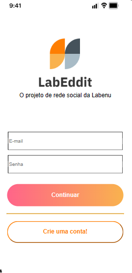
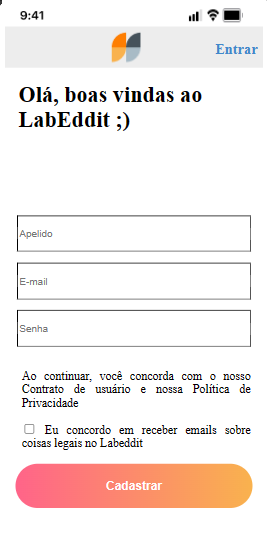
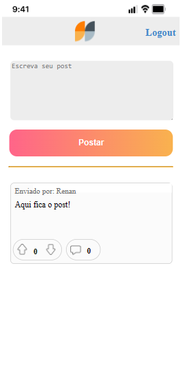
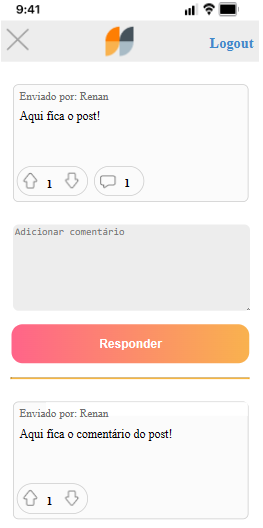

# Labeddit

Trabalho realizado com fins acadêmicos. A proposta do projeto é criar endPoints para uso do Front-end.
O projeto foi um requisito do curso de desenvolvimento full-stack da Labenu.

Projeto foi criado para formato de celular.

# Link do Deploy do Front-End
https://projetolabeddit-renan.surge.sh/posts

# Link para uso dos Paths (Back-end Deploy)
https://projeto-labeddit-back-izjw.onrender.com

# Documentação no Postman (Back-end)
https://documenter.getpostman.com/view/26594293/2s9YJc2NxH

# Projeto Back-end
Link do Back-end do projeto : https://github.com/renanolivex/Projeto-labeddit-back

# Súmario

- <a>EXEMPLOS</a>
- <a>TECNOLOGIAS</a>
- <a>DESENVOLVEDOR</a>
 
# Exemplos

## Tela de login "/"

## Tela de cadastro "/signup"

## Tela de posts "/posts/"

## Tela de comentários de posts "/comments"

# Tecnologias 
Para a criação do projeto foram utilizadas as principais ferramentas:
- React
- React Router
- Styled Components

# Desenvolvedor

 

Renan N. de Oliveira

